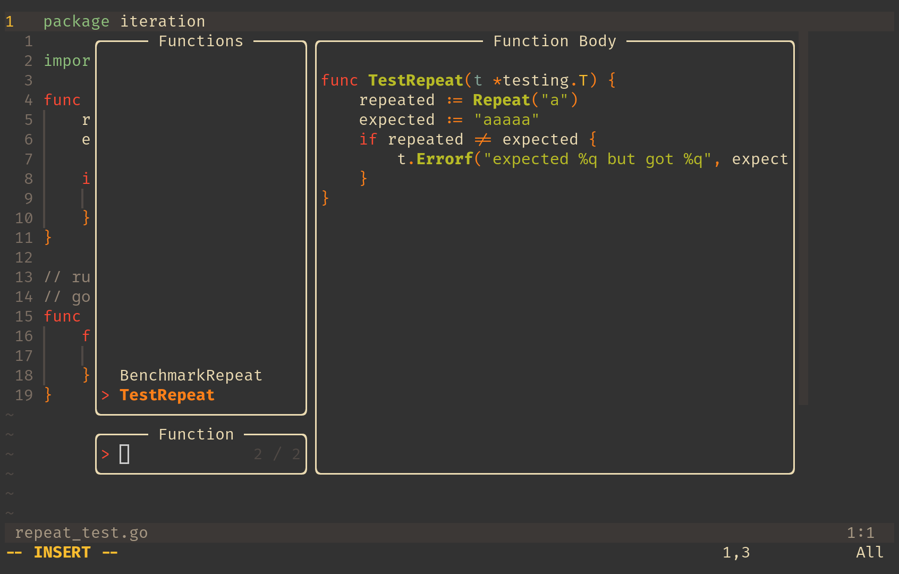
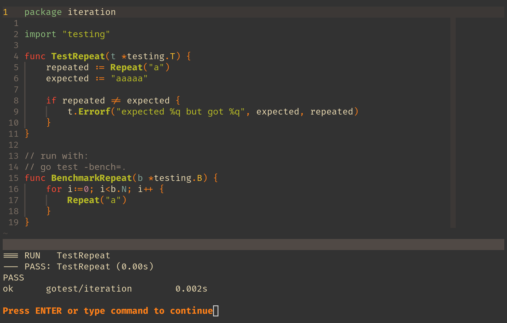

# GoTest.NVIM

- A simple plugin to run go tests from within Neovim

## Installation 

- using your package manager add the following
    - `"cademichael/gotest.nvim` => example using lazy.nvim
- the exact format will depend on your package manager

## novel features

- golang allows for testing individual function (kindof)
- you pass a string to the test command, and the command will run all test functions that contain that string
- ie
```sh
go test -run TestHello
```
- will run any function that contains "TestHello" and report status of executing the test
- the **main goal** of this plugin is to allow you to run individual test functions without leaving the file that you are writing these functions in

## general features

- run an indivual test function
    - when the command **GoTestFunction** is called a TreeSitter query is used to find all function names
    - a Telescope picker is created to show all function names and preview their function bodies
    - upon selection a test command, filtering functions that match the selected function
    - the output is displayed to the user
- run all tests (from present working nvim directory)
    - the directy the test command originates from can be seen with 
    - `:pwd`

## considerations

- `go test` works with modules and will test based on the module in the directory from which the command is executed
- this directory is usually the same directory that nvim is started from
- this means you should open nvim from the module directory that you are testing

## Requirements

- telescope
- treesitter

## Config

- right now it uses global variables I might change it to a `.setup()` function
- before requiring the package you will need to define the global variables if you don't want the defaults
- if using lazy add the requirements so that *gotest* loads after *treesitter* and *telescope*

```lua
"cademichael/gotest.nvim",
dependencies = {
    'nvim-treesitter/nvim-treesitter',
    'nvim-telescope/telescope.nvim',
},
config = function()
    -- defaults
    vim.g.gotest = {
        test_cmd = "go test -run ",
        preview_cutoff = 0,
        preview_width = 0.67
    }
    local goTest = require("gotest")
    vim.keymap.set("n", "<Space>tf", goTest.goFuncTester)
    vim.keymap.set("n", "<Space>tm", goTest.goModTester)
end
```

## Gallery

- **function picker**


- **test execution output**

